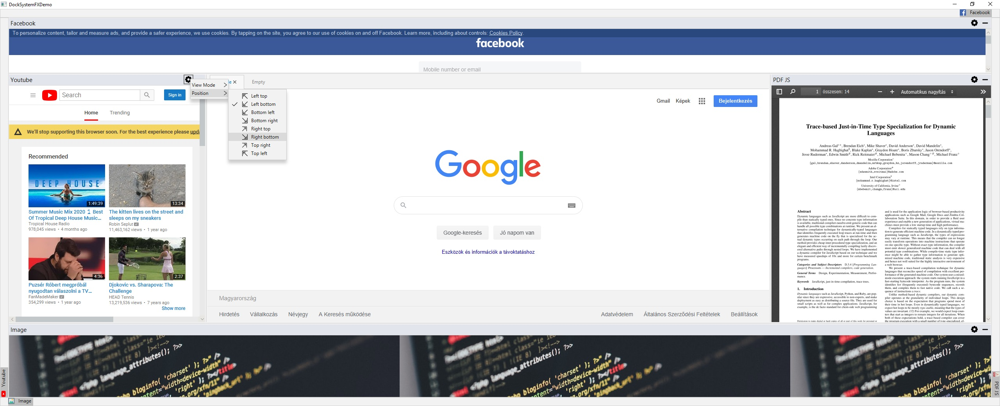
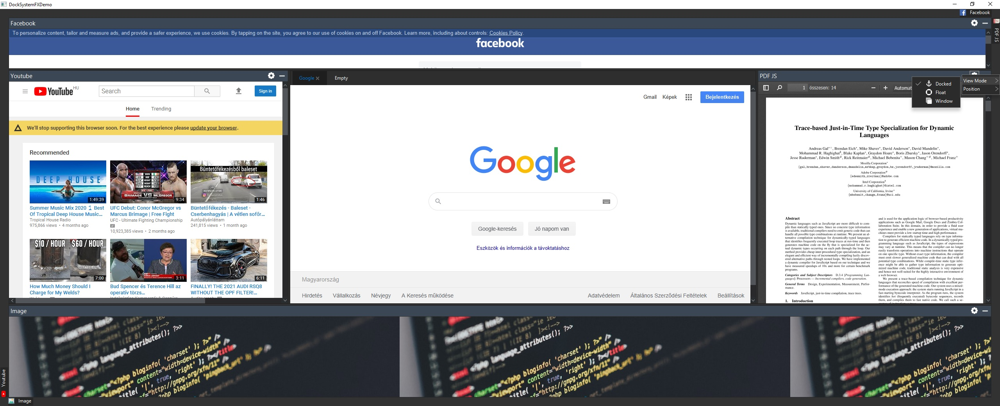

# 

<b align="center">Create advanced GUIs easily with this library!</b>

##Some screenshots
<i>Light style + <a href="https://github.com/JFXtras/jfxtras-styles/tree/master/src/jmetro">JMetro</a>'s light style</i>

<i>Dark Style + <a href="https://github.com/JFXtras/jfxtras-styles/tree/master/src/jmetro">JMetro</a>'s dark style</i>

##More documentation coming soon...