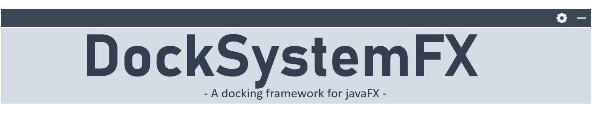
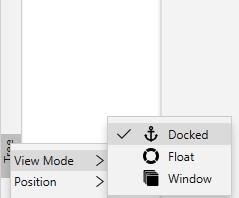

# 

<hr>
<b align="center">Create advanced javaFX GUIs easily with this library!</b>
<hr>

## Some screenshots

<i>Light style + <a href="https://github.com/JFXtras/jfxtras-styles/tree/master/src/jmetro">JMetro</a>'s light style</i>


<i>Dark Style + <a href="https://github.com/JFXtras/jfxtras-styles/tree/master/src/jmetro">JMetro</a>'s dark style</i>


## Features
* Supports <b>8</b> dock-positions:
    * `TOP>LEFT`
    * `TOP>RIGHT`
    * `LEFT>TOP`
    * `LEFT>BOTTOM`
    * `RIGHT>TOP`
    * `RIGHT>BOTTOM`
    * `BOTTOM>LEFT`
    * `BOTTOM>RIGHT`

* Supports <b>3</b> view modes:
    * `PINNED` - the dock-panel is docked normally inside the dock-system
    * `FLOAT` - the dock-panel is displayed inside a floating window
    * `WINDOW` - the dock-panel is displayed inside a normal window

* Supports internationalization
* Supports the javaFX <b>CSS</b> based styling

## How to include it into your project

#### 1. Manually
You can download a jar file from the releases. Every release has two jar files: one is a single jar without
the dependencies and the other one is a fat jar that includes all dependencies. 

#### 2. Using with Maven, Gradle etc...

<b>Maven example:</b><br>

Add JitPack.io to your repositories :
```xml
<repositories>
   <repository>
     <id>jitpack.io</id>
     <url>https://jitpack.io</url>
   </repository>
</repositories>
```
Add the dependency:
```xml
<dependency>
    <groupId>com.github.Dansoftowner</groupId>
    <artifactId>DockSystemFX</artifactId>
    <version>v1.0</version>
</dependency>
```

<b>Gradle example</b>

Add the repository:
```groovy
repositories {
    //...
    maven { url 'https://jitpack.io' }
}
```

Add the dependency:
```groovy
dependencies {
    //...
    implementation 'com.github.Dansoftowner:DockSystemFX:v1.0'
}
```

## The structure of a DockSystem

The image below illustrates the structure of a `DockSystem`:


As you can see a `DockSystem` consists of two important parts: 

* a `DockFrame` -> responsible for displaying `BorderButton`s on the edges 
* a `SplitPaneSystem` -> responsible for displaying `DockNode`s

A `DockSystem` has a <b>center area</b> where the main content displayed. When all `DockNode` is closed, only 
this part is visible.

#### Creating a DockSystem object

To create a `DockSystem` we need to pass a type parameter that defines what kind of `Node` we want
to display on the <b>center area</b>.

If we want to stay in general, we can do this:
```java
DockSystem<Node> dockSystem = new DockSystem<>();
```
In this case we can display any type of `Node` object in the center:
```java
dockSystem.setDockedCenter(new Button()); // OK
dockSystem.setDockedCenter(new Pane()); // OK
dockSystem.setDockedCenter(new BorderPane()); // OK 
```

But if we want to be more concrete, for example we can do this:
```java
DockSystem<StackPane> dockSystem = new DockSystem<>();
```
In this case only `StackPane` objects can be displayed in the center:
```
dockSystem.setDockedCenter(new Button()); // ERROR
dockSystem.setDockedCenter(new Pane()); // ERROR
dockSystem.setDockedCenter(new StackPane()); // OK
```

You can also use the constructor for defining the center:
```java
DockSystem<TabPane> dockSystem = new DockSystem<>(new TabPane());
```

## DockNodes

A `DockNode` is a "tool window" that is displayed in a `SplitPaneSystem`.

<table>
<tr>
<td>


</td>
<td>

<table>
<tr>
<td>


Selecting the view mode

</td>
</tr>
<tr>
<td>


Selecting the positions

</td>
</tr>
</table>

</td>
</tr>
</table>

A `DockNode` consists of two areas: 
* a TitleBar -> displays the title, a button that calls the options-menu, and a hide button.
* an actual content -> it depends on you what it is

In a `DockSystem` every `DockNode` has a `BorderButton` that is displayed on the `DockFrame`. 
For example, if the title of a `DockNode` is "Tree", the `BorderButton` looks like this: <br>


The menu can be called by right-clicking the `BorderButton` as well:

<table>

<tr>

<td>



</td>

<td>


</td>

</tr>

</table>

#### Using DockNodes in code

When we create a `DockNode`, we must specify the `DockSystem` and the title:
```java
DockNode dockNode = new DockNode(dockSystem, "Tool window");
```
Optionally, you can specify the graphic (icon) of the `DockNode` too:
```java
DockNode dockNode = new DockNode(dockSystem, "Tool window", new ImageView(new Image("path/to/your/icon")));
```
We should set the content of the `DockNode`:
```java
dockNode.setContent(new Label("Content"));
```

We can specify the initial dock-position:
```java
dockNode.setDockPosition(DockPosition.BOTTOM_RIGHT);
```

Now we can show it if we want:
```java
dockNode.show();
```

## Styling

Coming soon